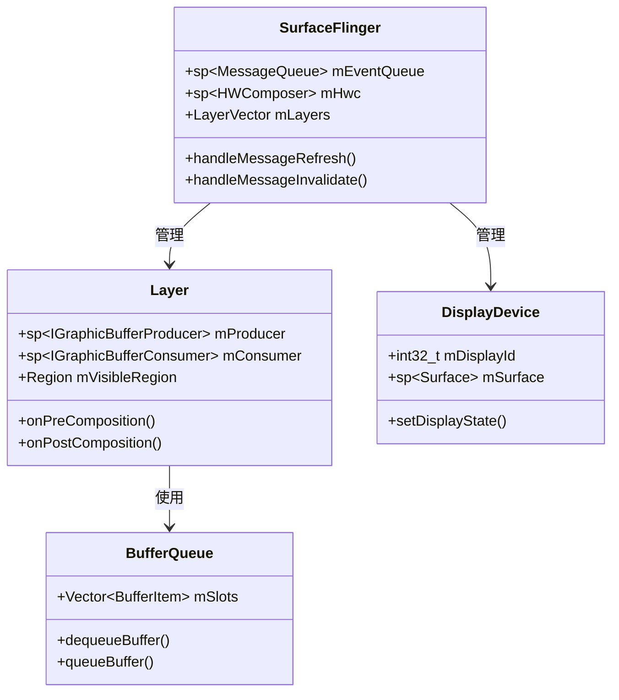

# SurfaceFlinger核心知识：概述与数据结构

## 1. 模块概述

SurfaceFlinger是Android显示系统的核心合成器服务，负责将来自不同应用的图层（Layer）合成为最终的显示画面。作为系统级服务，SurfaceFlinger运行在独立的进程中，通过Binder机制与应用进程通信。

### 1.1 核心职责
- **图层管理**：管理所有应用的Surface图层
- **合成调度**：基于VSync信号进行帧合成调度
- **显示输出**：将合成结果输出到物理显示设备
- **性能优化**：通过HWC（硬件合成器）优化合成性能

### 1.2 系统架构位置
```
应用层 (App) → 框架层 (Framework) → SurfaceFlinger → HWC → 显示驱动
```

## 2. 主要数据结构

### 2.1 核心类结构

#### 2.1.1 SurfaceFlinger主类
```cpp
class SurfaceFlinger : public BnSurfaceComposer, public IBinder::DeathRecipient {
private:
    sp<MessageQueue> mEventQueue;           // 消息队列
    sp<HWComposer> mHwc;                    // 硬件合成器
    LayerVector mLayers;                    // 图层集合
    DefaultKeyedVector<wp<IBinder>, sp<DisplayDevice>> mDisplays; // 显示设备
    bool mRepaintEverything;                // 重绘标志
    // ... 其他成员变量
};
```

#### 2.1.2 Layer类层次结构
```cpp
// Layer基类
class Layer : public virtual RefBase {
protected:
    sp<IGraphicBufferProducer> mProducer;   // 生产者接口
    sp<IGraphicBufferConsumer> mConsumer;   // 消费者接口
    Region mVisibleRegion;                  // 可见区域
    uint32_t mTransform;                    // 变换矩阵
    float mAlpha;                           // 透明度
    // ... 其他成员
};

// 具体Layer实现
class BufferLayer : public Layer {
    sp<BufferQueueLayer> mBufferLayer;     // 缓冲区队列图层
    // ... 缓冲区管理相关
};

class ColorLayer : public Layer {
    // ... 纯色图层实现
};
```

### 2.2 关键数据结构详解

#### 2.2.1 BufferQueue机制
```cpp
class BufferQueue {
private:
    Vector<BufferItem> mSlots;              // 缓冲区槽位
    sp<IGraphicBufferProducer> mProducer;   // 生产者端
    sp<IGraphicBufferConsumer> mConsumer;   // 消费者端
    int mMaxAcquiredBufferCount;            // 最大获取缓冲区数
    // ... 缓冲区状态管理
};
```

#### 2.2.2 DisplayDevice显示设备
```cpp
class DisplayDevice {
private:
    int32_t mDisplayId;                     // 显示设备ID
    sp<Surface> mSurface;                   // 显示表面
    DisplayConfig mConfig;                  // 显示配置
    // ... 显示属性管理
};
```

### 2.3 核心接口定义

#### 2.3.1 ISurfaceComposer接口
```cpp
class ISurfaceComposer : public IInterface {
public:
    DECLARE_META_INTERFACE(SurfaceComposer)
    
    virtual status_t createSurface(const String8& name,
                                  uint32_t w, uint32_t h, PixelFormat format,
                                  uint32_t flags, sp<IBinder>* handle,
                                  sp<IGraphicBufferProducer>* gbp) = 0;
    
    virtual status_t setTransactionState(const Vector<ComposerState>& state,
                                       const Vector<DisplayState>& displays,
                                       uint32_t flags) = 0;
    // ... 其他接口方法
};
```

## 3. 核心集合管理

### 3.1 图层集合管理
SurfaceFlinger通过`LayerVector`管理所有活跃的图层：
- **mCurrentState.layersSortedByZ**：按Z序排序的图层列表
- **mLayersPendingRefresh**：待刷新图层列表
- **mVisibleRegionsDirty**：可见区域脏标记

### 3.2 显示设备管理
通过`DefaultKeyedVector`管理多个显示设备：
- **主显示设备**：DisplayId = 0
- **虚拟显示设备**：用于录屏、投屏等场景
- **外部显示设备**：HDMI等外部连接

### 3.3 缓冲区管理
采用三级缓冲机制：
- **前台缓冲区**：当前正在显示的缓冲区
- **后台缓冲区**：正在合成的缓冲区  
- **空闲缓冲区**：可用的缓冲区池

## 4. 帧率控制数据结构

### 4.1 RefreshRate（刷新率）
**定义**：描述显示器支持的刷新率配置

```cpp
struct RefreshRate {
    int id;                    // 刷新率ID
    float fps;                 // 帧率值（Hz）
    nsecs_t period;            // 周期（纳秒）
    int configId;              // 显示配置ID
    HwcConfigIndexType hwcId;  // HWC配置索引
    
    bool operator==(const RefreshRate& other) const {
        return fps == other.fps && configId == other.configId;
    }
    
    bool operator!=(const RefreshRate& other) const {
        return !(*this == other);
    }
};
```

### 4.2 RefreshRateConfigs（刷新率配置）
**定义**：管理所有支持的刷新率配置

```cpp
class RefreshRateConfigs {
public:
    // 获取支持的刷新率列表
    const std::vector<RefreshRate>& getRefreshRates() const;
    
    // 获取当前刷新率
    const RefreshRate& getCurrentRefreshRate() const;
    
    // 获取默认刷新率
    const RefreshRate& getDefaultRefreshRate() const;
    
    // 获取最小刷新率
    const RefreshRate& getMinRefreshRate() const;
    
    // 获取最大刷新率
    const RefreshRate& getMaxRefreshRate() const;
    
    // 选择最优刷新率
    RefreshRate selectBestRefreshRate(
        float desiredFps,
        const FrameRateOverride& override);
    
private:
    std::vector<RefreshRate> mRefreshRates;  // 支持的刷新率列表
    RefreshRate mCurrentRefreshRate;          // 当前刷新率
    RefreshRate mMinRefreshRate;              // 最小刷新率
    RefreshRate mMaxRefreshRate;              // 最大刷新率
    RefreshRate mDefaultRefreshRate;          // 默认刷新率
};
```

### 4.3 FrameRateOverride（帧率覆盖请求）
**定义**：应用请求的帧率覆盖配置

```cpp
struct FrameRateOverride {
    uid_t uid;           // 应用UID
    float frameRate;     // 请求的帧率（0表示取消请求）
    bool seamless;       // 是否支持无缝切换
    
    bool operator==(const FrameRateOverride& other) const {
        return uid == other.uid;
    }
    
    bool operator!=(const FrameRateOverride& other) const {
        return !(*this == other);
    }
};
```

### 4.4 ADFRConfig（ADFR配置）
**定义**：自适应显示帧率（Adaptive Display Frame Rate）配置

```cpp
struct ADFRConfig {
    bool enabled;                    // 是否启用ADFR
    float minFrameRate;              // 最小帧率
    float maxFrameRate;              // 最大帧率
    float defaultFrameRate;          // 默认帧率
    int switchDelayMs;               // 切换延迟（毫秒）
    bool seamlessSwitch;             // 无缝切换
    
    // 功耗感知参数
    struct PowerParameters {
        float lowPowerThreshold;         // 低功耗阈值
        float highPowerThreshold;        // 高功耗阈值
        int thermalThrottleLevel;        // 热限制级别
        bool batterySaverMode;           // 省电模式
    } powerParams;
    
    // 场景检测参数
    struct SceneDetectionParams {
        bool enableGameDetection;        // 游戏检测
        bool enableVideoDetection;       // 视频检测
        bool enableStaticDetection;      // 静态内容检测
        int detectionIntervalMs;         // 检测间隔
    } sceneParams;
};
```

### 4.5 FrameRateHint（帧率提示）
**定义**：应用提供的帧率范围提示

```cpp
struct FrameRateHint {
    float minFrameRate;     // 最小帧率
    float maxFrameRate;     // 最大帧率
    float preferredRate;    // 偏好帧率
    int priority;           // 优先级
    
    enum Priority {
        PRIORITY_LOW = 0,
        PRIORITY_NORMAL = 1,
        PRIORITY_HIGH = 2
    };
};
```

### 4.6 VRRParams（可变刷新率参数）
**定义**：Variable Refresh Rate（VRR）配置参数

```cpp
struct VRRParams {
    bool enabled;                  // 是否启用VRR
    float minRefreshRate;          // 最小刷新率
    float maxRefreshRate;          // 最大刷新率
    bool enableLFC;                // Low Framerate Compensation
    
    // LFC参数
    struct LFCParams {
        float minRate;             // LFC最小帧率
        int multiplier;            // 倍频系数
    } lfcParams;
};
```

### 4.7 FrameRateSelector（帧率选择器）
**定义**：智能选择最优帧率的核心类

```cpp
class FrameRateSelector {
public:
    // 选择最优帧率
    RefreshRate selectOptimalFrameRate(
        const std::vector<FrameRateOverride>& overrides,
        const PowerState& powerState);
    
    // 计算切换代价
    int calculateSwitchCost(
        const RefreshRate& from,
        const RefreshRate& to);
    
    // 检查是否支持无缝切换
    bool canSwitchSeamlessly(
        const RefreshRate& from,
        const RefreshRate& to);
    
private:
    RefreshRateConfigs mConfigs;     // 刷新率配置
    ADFRConfig mADFRConfig;          // ADFR配置
    SceneDetector mSceneDetector;    // 场景检测器
};
```

## 4. 数据流模型

### 4.1 应用数据流
```
App绘制 → BufferQueue入队 → SurfaceFlinger消费 → HWC合成 → 显示输出
```

### 4.2 合成数据流
```
VSync信号 → 图层收集 → 可见性计算 → 合成策略选择 → 实际合成 → 显示提交
```

## 5. 关键配置参数

### 5.1 性能相关配置
```properties
# 最大缓冲区数量
surfaceflinger.max_frame_buffer_acquired_buffers=2

# 最小获取缓冲区数
surfaceflinger.min_acquired_buffers=1

# 图形最大尺寸限制
surfaceflinger.max_graphics_width=4096
surfaceflinger.max_graphics_height=4096
```

### 5.2 调试相关配置
```properties
# ATRACE跟踪开关
debug.sf.layer_trace=true

# 合成类型显示
debug.sf.show_updates=1

# 帧率显示
debug.sf.show_fps=1
```

## 6. 类图示意



这个文档详细介绍了SurfaceFlinger的核心数据结构和基础概念，为后续深入分析其内部流程和机制奠定了基础。