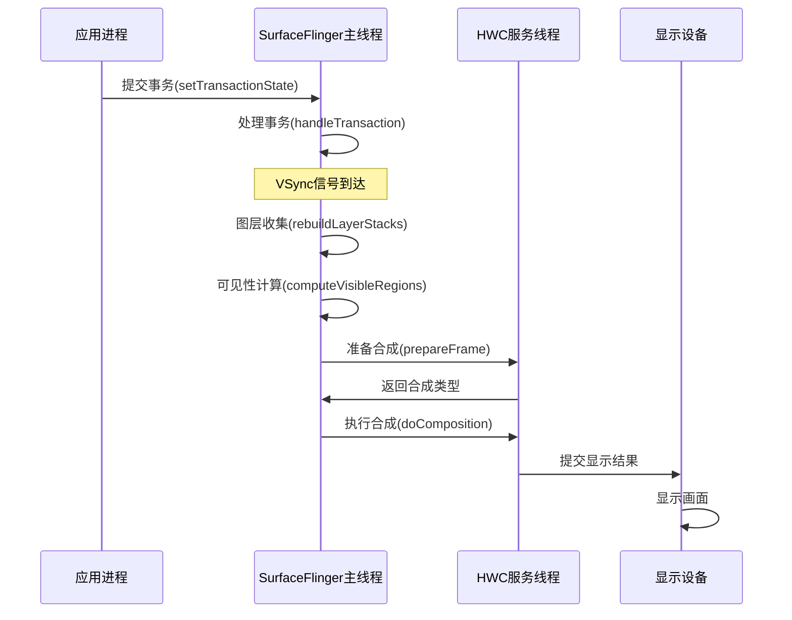
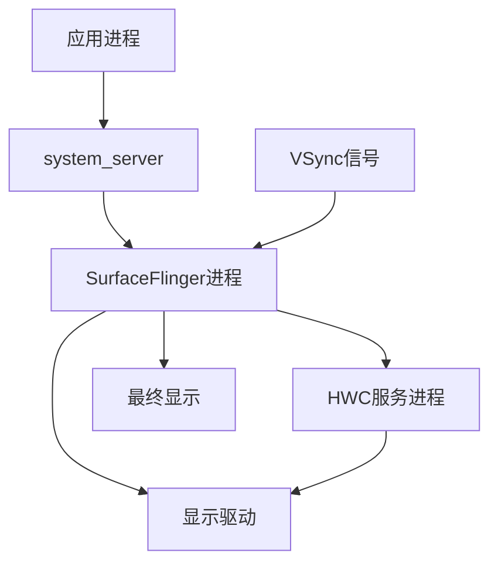

# SurfaceFlinger核心知识：设计思路与线程进程模型

## 1. 分层设计架构

### 1.1 整体架构分层

SurfaceFlinger采用经典的分层架构设计，各层职责明确：

```
应用层 (Application Layer)
    ↓
框架层 (Framework Layer) - SurfaceControl/WindowManager
    ↓
合成服务层 (SurfaceFlinger Service)
    ↓
硬件抽象层 (HAL Layer) - HWC/Display HAL
    ↓
内核驱动层 (Kernel Driver) - DRM/FBDEV
```

### 1.2 各层交互关系

#### 1.2.1 应用层与框架层交互
- **Surface创建**：应用通过WindowManager创建Surface
- **绘制提交**：应用通过Canvas/OpenGL绘制内容到Surface
- **事务提交**：通过SurfaceControl提交图层变更事务

#### 1.2.2 框架层与合成服务层交互
```cpp
// 事务提交流程
class SurfaceComposerClient {
public:
    status_t setLayer(const sp<SurfaceControl>& sc, int32_t layer) {
        ComposerState s;
        s.state.what = layer_state_t::eLayerChanged;
        s.state.surface = sc->getHandle();
        s.state.layer = layer;
        return mClient->setTransactionState({s}, {}, 0);
    }
};
```

#### 1.2.3 合成服务层与硬件抽象层交互
- **HWC准备**：通过HWC接口准备硬件合成
- **显示配置**：设置显示设备的参数和模式
- **合成执行**：调用HWC进行实际的图层合成

## 2. 通信机制设计

### 2.1 Binder通信接口

#### 2.1.1 ISurfaceComposer接口定义
```cpp
// 核心Binder接口
class BnSurfaceComposer : public BnInterface<ISurfaceComposer> {
public:
    virtual status_t onTransact(uint32_t code, const Parcel& data,
                               Parcel* reply, uint32_t flags = 0) {
        switch (code) {
            case CREATE_SURFACE:
                // 处理Surface创建请求
                break;
            case SET_TRANSACTION_STATE:
                // 处理事务状态设置
                break;
        }
    }
};
```

#### 2.1.2 事务状态同步机制
```cpp
// 事务状态同步流程
status_t SurfaceFlinger::setTransactionState(
    const Vector<ComposerState>& state,
    const Vector<DisplayState>& displays,
    uint32_t flags) {
    
    // 1. 验证事务状态
    if (!validateTransactionState(state, displays)) {
        return BAD_VALUE;
    }
    
    // 2. 应用事务到当前状态
    applyTransactionState(state, displays);
    
    // 3. 触发刷新
    signalTransaction();
    return NO_ERROR;
}
```

### 2.2 VSync同步机制

#### 2.2.1 VSync信号生成
```cpp
class VSyncSource {
public:
    virtual nsecs_t computeNextVSyncTime(nsecs_t now) = 0;
    virtual void setVSyncEnabled(bool enable) = 0;
};

// DispSync实现
class DispSync : public VSyncSource {
    void addEventListener(const char* name, nsecs_t phase,
                         const sp<DispSync::Callback>& callback);
    void removeEventListener(const sp<DispSync::Callback>& callback);
};
```

#### 2.2.2 VSync分发流程
```
硬件VSync → DispSync → SurfaceFlinger主线程 → Choreographer → 应用渲染线程
```

## 3. 核心机制实现

### 3.1 图层合成机制

#### 3.1.1 合成策略选择
```cpp
// 合成策略决策逻辑
bool SurfaceFlinger::chooseCompositionType() {
    // 1. 检查HWC支持情况
    if (mHwc->hasDeviceComposition()) {
        // 优先使用硬件合成
        return COMPOSITION_DEVICE;
    }
    
    // 2. 检查GPU合成条件
    if (canUseGPUComposition()) {
        return COMPOSITION_CLIENT;
    }
    
    // 3. 回退到软件合成
    return COMPOSITION_SOLID_COLOR;
}
```

#### 3.1.2 可见性计算算法
```cpp
// 可见区域计算
void SurfaceFlinger::computeVisibleRegions() {
    for (auto& layer : mLayers) {
        // 计算图层在屏幕上的可见区域
        Region visible = layer->getVisibleRegion(mTransparentRegionHint);
        
        // 考虑父级裁剪和兄弟图层遮挡
        visible = visible.subtract(mCoveredByOpaqueLayers);
        
        layer->setVisibleRegion(visible);
    }
}
```

### 3.2 帧率选择机制

#### 3.2.1 多刷新率支持
```cpp
class RefreshRateSelector {
public:
    // 获取最优刷新率
    RefreshRate chooseRefreshRate(const FrameRateOverride& override) {
        // 考虑应用请求、热限制、功耗策略
        return selectBestRefreshRate(override);
    }
    
    // 刷新率切换逻辑
    void setRefreshRate(const RefreshRate& rate) {
        // 平滑切换刷新率
        performRefreshRateSwitch(rate);
    }
};
```

#### 3.2.2 帧率协商流程
```
应用请求帧率 → 系统策略评估 → 硬件能力检查 → 实际设置帧率
```

## 4. 线程进程模型

### 4.1 进程模型

#### 4.1.1 SurfaceFlinger进程启动
```bash
# 进程启动流程
init进程 → surfaceflinger.rc → /system/bin/surfaceflinger → SurfaceFlinger服务

# 进程状态查看
ps -A | grep surfaceflinger
# 输出：system 481 1 80864 13700 0 0 S surfaceflinger
```

#### 4.1.2 与其他进程关系
- **system_server**：通过Binder通信，接收窗口管理请求
- **应用进程**：通过Binder提交图层数据
- **HWC服务进程**：硬件合成服务进程

### 4.2 线程模型

#### 4.2.1 主线程（SurfaceFlinger线程）
```cpp
// 主线程消息处理循环
void SurfaceFlinger::run() {
    do {
        waitForEvent();
        
        // 处理消息队列
        while (Message* msg = mEventQueue->next()) {
            switch (msg->what) {
                case MessageQueue::INVALIDATE:
                    handleMessageInvalidate();
                    break;
                case MessageQueue::REFRESH:
                    handleMessageRefresh();
                    break;
            }
        }
    } while (true);
}
```

#### 4.2.2 主要线程及职责

| 线程名称 | 职责描述 | 关键方法 |
|---------|---------|---------|
| SurfaceFlinger主线程 | 合成调度和图层管理 | handleMessageRefresh() |
| Binder线程池 | 处理IPC请求 | onTransact() |
| EventThread | VSync事件分发 | dispatchVsync() |
| HWC服务线程 | 硬件合成执行 | doComposition() |

### 4.3 线程间通信

#### 4.3.1 消息队列机制
```cpp
class MessageQueue {
public:
    enum {
        INVALIDATE = 0,    // 无效化消息
        REFRESH = 1,       // 刷新消息
    };
    
    void postMessage(sp<MessageHandler> handler, Message& message);
    void waitMessage();
};
```

#### 4.3.2 条件变量同步
```cpp
// 线程同步示例
class SurfaceFlinger::TransactionState {
    mutable Mutex mLock;
    Condition mCondition;
    
    void waitForTransaction() {
        Mutex::Autolock lock(mLock);
        while (!mTransactionCompleted) {
            mCondition.wait(mLock);
        }
    }
};
```

## 5. 权限控制机制

### 5.1 图层访问控制
```cpp
// 权限检查逻辑
bool SurfaceFlinger::checkLayerPermissions(const sp<IBinder>& handle) {
    // 检查调用者UID/GID权限
    IPCThreadState* ipc = IPCThreadState::self();
    uid_t uid = ipc->getCallingUid();
    
    // 系统应用和特定UID有特殊权限
    if (uid == AID_SYSTEM || uid == AID_GRAPHICS) {
        return true;
    }
    
    // 普通应用权限检查
    return checkAppLayerPermissions(uid, handle);
}
```

### 5.2 显示配置权限
- **系统级配置**：只有系统进程可以修改全局显示配置
- **应用级配置**：应用只能修改自己的图层属性
- **安全显示**：支持安全显示内容的权限控制

## 6. 设计示意图

### 6.1 线程交互流程图


### 6.2 进程架构图


这个文档详细分析了SurfaceFlinger的设计思路和线程进程模型，为理解其内部工作机制提供了完整的框架。